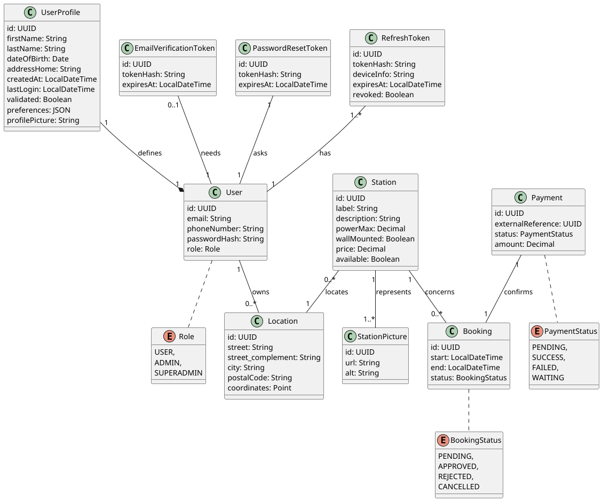

# ELECTRICITY BUSINESS - BACKEND

`Electricity Business` is a training project designed to learn how to prepare and build a fullstack
web app. This concept would allow a user to log into the app, rent their personal EV (Electric
Vehicle) charging station to users, and book other users' charging stations.

## Environment variables

Since the goal is to deploy it and be able to test this app on a mobile device, this project uses
environment variables. Here are a few ways to set the environment variables to be able to use this
project.

### 1. Using IntelliJ IDEA

With Intellij IDEA, environment variables can be set directly in the IDE:

- Click on the `Run / Debug Configurations` button (next to the buttons `Run` & `Debug`)
- `Edit Configurations`
- Then allow environment variables in `Modify Options`.
- Now, write the variables below with your own values in the relevant field and IntelliJ will
  automatically read them when starting the app.

Note: profiles (`dev`, `prod`, etc.) are also set there and might need to be set up as well.

```yaml
  # The following values are examples and not be used for live applications 

  # App
  APP_BASE_URL=http://localhost:8080

  # Database
  MYSQL_DATABASE=db_electricity_business
  MYSQL_USER=dev
  MYSQL_PASSWORD=password
  MYSQL_ROOT_PASSWORD=root

  # Mail
  MAIL_HOST=<mail-hosting-service>
  MAIL_PORT=<mail-port>
  MAIL_USERNAME=<mail-hosting-service-username>
  MAIL_PASSWORD=<app-mail-password>

  # JWT
  JWT_ISSUER=<jwt-issuer-token>
  JWT_ACCESS=5m
  JWT_REFRESH=7d
  JWT_VERIFICATION=1d
  JWT_PASSWORD=15m
```

### 2. With local environment variables

If you're setting up a full environment (for example, deploying the app on your own server), you
might want to set these environment variables directly on your device. In this case, refer to your
operating system's documentation to set environment variables.

### 3. Other methods

Other methods to set environment variables exist, one of them would be to add a
`application-dev.properties` file, add it to the `.gitignore` file and add the environment variables
in plain text. Perhaps not the best implementation, but the easiest.

## Dependencies (soon)

## UML Class Diagram


